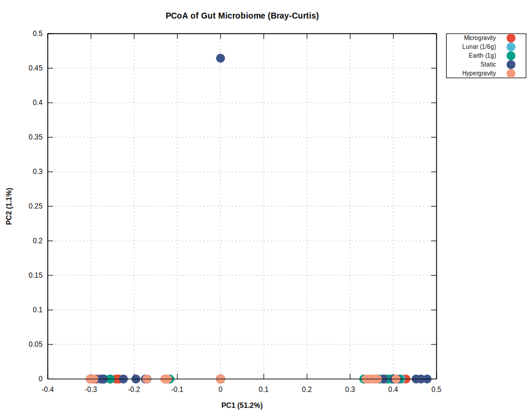

# Microbiome Analysis: アルゴリズムと処理内容

## 概要

本システムは、重力環境下で培養されたヒト腸内細菌叢の16S rRNAシーケンシングデータを解析する。
データから群集構造の特徴抽出、統計検定、細菌間相互作用の推定、時系列予測までを行う。

Common Lispで実装され、外部ライブラリへの依存を最小限に抑えている。
可視化にはGnuplotを使用する。

---

## データ構造

### 入力データ
- 3名のドナー（D1, D2, D3）
- 5つの重力条件
  - 0g: 微小重力（クリノスタットで模擬）
  - 1/6g: 月面重力
  - 1g: 地球重力（対照）
  - 1g_s: 地球重力（静置、クリノスタット非使用）
  - 5g: 過重力（遠心機）
- 4時点（0h, 8h, 16h, 24h）
- 各条件3レプリケート
- 120種の細菌（属レベル）

### データ形式

CSVファイル：
```
SampleID,SampleType,Donor,Gravity,Time,Replicate,TotalReads,Bacteroides,Prevotella,...
D1,baseline,1,baseline,0h,0,30527,11672,0,...
G0g_T8h_D1_R1,culture,1,0g,8h,1,21028,10308,0,...
```

### 前処理

1. **データ読み込み**: CSVをパースし、メタデータと存在量行列に分離
2. **相対存在量への変換**: 各サンプルのリード数を総リード数で除算
   ```
   relative_abundance[i][j] = raw_counts[i][j] / sum(raw_counts[i])
   ```
3. **フィルタリング**: baselineサンプル（培養前）を除外し、培養サンプル（135個）のみを解析

---

## 基礎解析

### Figure 1: PCoA（主座標分析）

**目的**: 120次元の群集データを2次元に圧縮し、サンプル間の類似性パターンを可視化する

**アルゴリズム詳細**:

#### Step 1: Bray-Curtis非類似度行列の計算

全サンプルペア間の非類似度を計算する。Bray-Curtis非類似度は群集生態学で最も広く使われる指標で、
存在量の差を0（完全一致）から1（完全不一致）のスケールで表す。

```
BC(sample_i, sample_j) = 1 - (2 * Σ min(x_ik, x_jk)) / (Σ x_ik + Σ x_jk)
```

ここで：
- x_ik: サンプルiにおける細菌kの相対存在量
- min(x_ik, x_jk): 両サンプルに共通する最小存在量

相対存在量の場合、分母は常に2になるため：
```
BC = 1 - Σ min(x_ik, x_jk)
```

実装：
```lisp
(defun bray-curtis-distance (v1 v2)
  (let ((sum-min 0.0) (sum-total 0.0))
    (dotimes (i (length v1))
      (incf sum-min (min (aref v1 i) (aref v2 i)))
      (incf sum-total (+ (aref v1 i) (aref v2 i))))
    (- 1.0 (/ (* 2.0 sum-min) sum-total))))
```

#### Step 2: 距離行列の中心化（Gower変換）

距離行列を内積行列に変換する。これにより固有値分解が可能になる。

```
A_ij = -0.5 * D_ij^2
B_ij = A_ij - mean(A_i.) - mean(A_.j) + mean(A_..)
```

ここで：
- D_ij: サンプルi,j間のBray-Curtis距離
- mean(A_i.): 行iの平均
- mean(A_.j): 列jの平均
- mean(A_..): 全体平均

#### Step 3: 固有値分解（べき乗法）

中心化行列Bの固有値と固有ベクトルを計算する。
計算コスト削減のため、完全な固有値分解ではなくべき乗法で上位5軸のみを計算。

べき乗法のアルゴリズム：
1. ランダムなベクトルvで初期化
2. 反復: v_new = B * v / ||B * v||
3. 収束判定: ||v_new - v|| < 10^-10
4. 固有値 λ = v' * B * v
5. デフレーション: B = B - λ * v * v' で次の固有値へ

#### Step 4: 座標の計算

固有ベクトルを固有値の平方根でスケーリング：
```
coord_i = eigenvector_i * sqrt(eigenvalue)
```

#### Step 5: 分散説明率

各軸が全体の変動のどの程度を説明するかを計算：
```
variance_explained[k] = eigenvalue[k] / sum(positive_eigenvalues) * 100
```

**出力**: ドナー別の3パネル散布図。各点は1サンプルを表し、色は重力条件を示す。
近い点は類似した群集構造を持つ。



---

### Figure 2: 組成バープロット

**目的**: 全サンプルの細菌組成を一覧で比較する

**処理詳細**:

#### Step 1: 優占種の選択

120種全てを表示すると見づらいため、上位10種を選択：
```
mean_abundance[j] = Σ_i abundance[i][j] / n_samples
top_taxa = sort(taxa, by=mean_abundance, descending=True)[:10]
```

#### Step 2: サンプルのソート

サンプルを以下の優先順位でソート：
1. ドナー（1 → 2 → 3）
2. 重力条件（0g → 1/6g → 1g → 1g_s → 5g）
3. 時点（8h → 16h → 24h）
4. レプリケート（1 → 2 → 3）

#### Step 3: 積み上げ棒グラフの描画

各サンプルについて、上位10種の相対存在量を積み上げて表示。
残りの種は "Others" としてまとめる。

**出力**: 135サンプルの組成バープロット。ラベル形式は `D{donor}_{gravity}_{time}_R{replicate}`


---

### Figure 3: 時間軌跡

**目的**: PCoA空間で群集が時間とともにどのように変化するかを追跡する

**処理詳細**:

#### Step 1: グループ平均の計算

同一条件（ドナー × 重力 × 時点）の3レプリケートの平均座標を計算：
```
mean_coord[donor][gravity][time] = mean(coords[matching_samples])
```

#### Step 2: 軌跡の結線

同一ドナー・重力条件の時点を8h → 16h → 24hの順に結線。
これにより群集の時間変化の方向が可視化される。

**解釈**: 
- 軌跡が長い：時間による変化が大きい
- 軌跡が収束：群集が安定化に向かう
- 重力条件で軌跡が異なる：重力が群集動態に影響


---

### Figure 4: Beta分散（BETADISPER）

**目的**: 各重力条件内でのサンプルのばらつき（分散）を定量化・比較する

**アルゴリズム詳細**:

#### Step 1: グループ重心の計算

各重力グループの重心（centroid）をPCoA空間で計算：
```
centroid[g] = (mean(PC1[g]), mean(PC2[g]))
```

#### Step 2: 重心からの距離

各サンプルから所属グループの重心までのユークリッド距離を計算：
```
distance[i] = sqrt((PC1[i] - centroid_PC1[g])^2 + (PC2[i] - centroid_PC2[g])^2)
```

この距離がそのサンプルの「分散への寄与」を表す。

#### Step 3: 分散の比較

距離の分布をボックスプロットで可視化し、グループ間で比較。

#### Step 4: 統計検定（並べ替え検定）

帰無仮説：全グループの分散は等しい

1. F統計量を計算（分散分析と同様）
2. グループラベルを999回ランダムにシャッフル
3. 各並べ替えでF統計量を計算
4. p値 = (観測値以上の回数 + 1) / (並べ替え回数 + 1)

**解釈**: 
- 分散が大きい：そのグループ内でサンプル間のばらつきが大きい
- グループ間で分散が異なる場合、PERMANOVAの結果解釈に注意が必要


---

### Figure 5: Top Taxa比較

**目的**: 主要細菌種が重力条件間でどのように異なるかを比較する

**処理詳細**:

#### Step 1: 上位種の選択

全サンプル平均で上位8種を選択（Figure 2と同様の手法）

#### Step 2: グループ平均の計算

各重力条件について、その条件に属する全サンプルの平均存在量を計算：
```
mean_by_gravity[g][taxon] = mean(abundance[samples in g][taxon])
```

#### Step 3: グループ化棒グラフ

8種 × 5条件のグループ化棒グラフを描画。
同一細菌種の棒が隣接し、重力条件を色分け。

**解釈**: 特定の細菌が特定の重力条件で増減しているパターンを視覚的に把握できる


---

### Figure 6: ヒートマップ

**目的**: 細菌の存在パターンを俯瞰的に把握する

**処理詳細**:

#### Step 1: データの集約

上位15種について、各条件（ドナー × 重力 × 時点）の平均存在量を計算。
3ドナー × 3重力（0g, 1g, 5g）× 3時点 = 27条件

#### Step 2: カラーマッピング

存在量を色にマッピング：
- 0（白）→ 0.5以上（濃い赤）
- 連続的なグラデーション

**解釈**: 
- 横軸：サンプル条件（ドナー/重力/時点）
- 縦軸：細菌種
- 色の濃淡：存在量の大小
- パターンの類似性から細菌のクラスタリングが視覚化される


---

## 統計検定

### PERMANOVA（Permutational Multivariate Analysis of Variance）

**目的**: 重力条件間で群集構造全体に統計的有意差があるかを検定する

**原理**: 
通常のANOVAは単変量データ（1つの変数）を対象とするが、
PERMANOVAは距離行列を用いて多変量データ（120種の存在量）を同時に検定できる。

**アルゴリズム詳細**:

#### Step 1: 平方和の分解

群間平方和（SS_between）と群内平方和（SS_within）を距離行列から直接計算：

```
SS_total = (1/n) * Σ_i Σ_j<i D_ij^2

SS_within = Σ_g (1/n_g) * Σ_i,j∈g, i<j D_ij^2

SS_between = SS_total - SS_within
```

ここで：
- D_ij: サンプルi,j間の距離
- n_g: グループgのサンプル数

#### Step 2: 疑似F統計量の計算

```
F = (SS_between / df_between) / (SS_within / df_within)

df_between = k - 1  (kはグループ数)
df_within = n - k   (nは総サンプル数)
```

#### Step 3: 並べ替え検定

1. 観測されたF値を記録
2. グループラベルをランダムにシャッフル（999回）
3. 各並べ替えでF値を計算
4. p値 = (観測F以上の回数 + 1) / 1000

**出力**:
- Pseudo-F: 疑似F統計量
- R²: 重力条件が説明する変動の割合
- p-value: 統計的有意性

**解釈**: 
- p < 0.05 なら重力条件間で有意な群集構造の違いがある
- R²は効果量を示す（0.1以上で実質的な効果）

---

### SIMPER（Similarity Percentages）

**目的**: 2群間の差に最も寄与している細菌種を特定する

**アルゴリズム詳細**:

#### Step 1: ペアワイズ比較

2つのグループ（例：0g vs 1g）の全サンプルペアについて、
各細菌種の存在量差の絶対値を計算：

```
contribution[taxon] = mean(|abundance_group1 - abundance_group2|)
```

#### Step 2: 寄与度のランキング

寄与度でソートし、累積寄与率を計算：
```
cumulative[k] = Σ_{i=1}^{k} contribution[i] / total_contribution * 100
```

**出力**: 寄与度上位10種と、それぞれの寄与率・累積寄与率

**解釈**: 累積寄与率70%に達する種が、群間差の主要な原因

---

## gLVモデルと予測解析

### Figure 10: ドナー間変動

**目的**: ドナー（個人）ごとの細菌組成の違いを定量化する

**処理詳細**:

各ドナーの全サンプル（45サンプル）の平均を計算し、
上位10種についてドナー間で比較。

**解釈**: 
- ドナー間変動が大きい：個人差が群集構造に大きく影響
- 特定の細菌がドナー特異的：その個人の「シグネチャー」種


---

### Figure 11: 優占種

**目的**: データセット全体で優占する細菌種を特定する

**処理詳細**:

1. 全サンプルでの平均存在量を計算
2. 上位8種を棒グラフで表示
3. 累積存在量を計算（上位8種で全体の何%を占めるか）

**解釈**: 
優占種は群集動態に大きな影響を与える可能性が高く、
予測モデルでの重要度が高い


---

### Figure 12: ネットワーク構造

**目的**: 細菌間の相互作用パターンを推定・可視化する

**アルゴリズム詳細**:

#### Step 1: 相互作用行列の推定（gLVモデルから）

gLVモデル（後述）のパラメータ推定により、120×120の相互作用行列Aを得る。
A_ij は細菌jが細菌iの増殖に与える影響を表す。

#### Step 2: 有意な相互作用の抽出

閾値（|A_ij| > 0.001）を超える相互作用のみをカウント：
```
n_positive = count(A_ij > 0.001)
n_negative = count(A_ij < -0.001)
```

#### Step 3: ネットワーク指標の計算

```
connectance = n_links / (n_taxa * n_taxa)
mean_strength = mean(|A_ij|) for significant links
```

#### Step 4: 上位相互作用のリスト化

最も強い正の相互作用（促進）と負の相互作用（抑制）をリスト化

**解釈**:
- 正の相互作用：共生、相利共生
- 負の相互作用：競争、拮抗
- 高い連結度：複雑なネットワーク構造


---

### Figure 13: gLV予測モデル

**目的**: 細菌間相互作用を考慮して群集動態を予測する

#### gLV（Generalized Lotka-Volterra）モデルとは

生態学で広く使われる群集動態モデル。各種の増殖率が、
自身の密度と他種との相互作用によって決まる：

```
dx_i/dt = x_i * (r_i + Σ_j A_ij * x_j)
```

- x_i: 細菌iの相対存在量（0-1の値）
- r_i: 細菌iの内在的増殖率（他種がいない場合の増殖率）
- A_ij: 細菌jが細菌iに与える影響（相互作用係数）
  - A_ij > 0: jはiの増殖を促進（相利共生、片利共生）
  - A_ij < 0: jはiの増殖を抑制（競争、捕食）
  - A_ii < 0: 自己抑制（環境収容力による制限）

**パラメータ推定の詳細**:

#### Step 1: 成長率の計算

連続する時点間（8h→16h、16h→24h）の変化から成長率を計算：

```
growth_rate_i = (ln(x_i(t2)) - ln(x_i(t1))) / (t2 - t1)
```

対数を取る理由：gLVモデルは指数的な増殖を仮定しており、
対数変換により線形回帰問題に帰着できる。

#### Step 2: 遷移データの収集

全ドナー、全重力条件、全レプリケートから遷移を収集：
- 各（ドナー, 重力, レプリケート）について2つの遷移
  - 8h → 16h
  - 16h → 24h
- 合計: 3ドナー × 5重力 × 3レプリケート × 2遷移 = 90遷移

ただし、一部のサンプルで細菌が検出されない場合があるため、
実際の遷移数は若干少なくなる（約45遷移）。

#### Step 3: Ridge回帰によるパラメータ推定

各細菌iについて、以下の回帰問題を解く：

```
growth_rate_i = r_i + Σ_j A_ij * x_j(t1)
```

これは線形回帰の形式：
```
y = β_0 + β_1*x_1 + β_2*x_2 + ... + β_n*x_n
```

ここで：
- y = growth_rate_i
- β_0 = r_i（切片 = 内在的増殖率）
- β_j = A_ij（回帰係数 = 相互作用係数）
- x_j = 細菌jの存在量

**Ridge回帰を使う理由**:
- 変数（細菌種）の数（120）がサンプル数（45）より多い
- 通常の最小二乗法では過学習が起きる
- L2正則化により安定した推定が可能

Ridge回帰の目的関数：
```
minimize: Σ(y - Xβ)^2 + λ * Σβ^2
```

閉形式解：
```
β = (X'X + λI)^(-1) * X'y
```

本実装では λ = 0.1 を使用。

実装（Gauss-Seidel法による反復解法）：
```lisp
(defun solve-normal-equations (XtX Xty n-params)
  (let ((params (make-array n-params :initial-element 0.0d0)))
    (dotimes (iter 2000)
      (dotimes (i n-params)
        (let ((sum (aref Xty i)))
          (dotimes (j n-params)
            (unless (= i j)
              (decf sum (* (aref XtX i j) (aref params j)))))
          (setf (aref params i) (/ sum (aref XtX i i))))))
    params))
```

#### Step 4: 数値シミュレーション（Runge-Kutta法）

推定したパラメータを使って、将来の群集構成を予測する。
微分方程式を数値的に解くためにRunge-Kutta法（4次）を使用。

Runge-Kutta法のアルゴリズム：
```
k1 = f(t, x)
k2 = f(t + dt/2, x + dt*k1/2)
k3 = f(t + dt/2, x + dt*k2/2)
k4 = f(t + dt, x + dt*k3)
x(t+dt) = x(t) + (dt/6) * (k1 + 2*k2 + 2*k3 + k4)
```

ここで f(t, x) はgLVの右辺：
```
f_i(t, x) = x_i * (r_i + Σ_j A_ij * x_j)
```

実装：
```lisp
(defun simulate-glv (x0 r A duration dt)
  (let* ((n-taxa (length x0))
         (n-steps (ceiling (/ duration dt)))
         (trajectory (make-array (list (1+ n-steps) n-taxa))))
    ;; 初期値を設定
    (dotimes (i n-taxa)
      (setf (aref trajectory 0 i) (aref x0 i)))
    ;; RK4で積分
    (dotimes (step n-steps)
      (let* ((x-current (get-row trajectory step))
             (k1 (glv-derivative x-current r A))
             (k2 (glv-derivative (add-scaled x-current k1 (* 0.5 dt)) r A))
             (k3 (glv-derivative (add-scaled x-current k2 (* 0.5 dt)) r A))
             (k4 (glv-derivative (add-scaled x-current k3 dt) r A)))
        ;; 次の時点を計算
        (dotimes (i n-taxa)
          (setf (aref trajectory (1+ step) i)
                (+ (aref x-current i)
                   (* (/ dt 6.0)
                      (+ (aref k1 i)
                         (* 2 (aref k2 i))
                         (* 2 (aref k3 i))
                         (aref k4 i))))))
        ;; 正規化（総和を1に）
        (normalize-row trajectory (1+ step))))
    trajectory))
```

#### Step 5: 予測の正規化

gLVモデルは絶対存在量を仮定しているが、16S rRNAデータは相対存在量である。
そのため、各時点で総和が1になるよう正規化：

```
x_normalized[i] = x[i] / Σ_j x[j]
```

**出力**: 上位6種について、観測データ（点）と予測曲線（線）を表示


---

### Figure 7: 線形予測

**目的**: 単純な線形外挿による48時間予測（gLVモデルとの比較用）

**アルゴリズム詳細**:

#### Step 1: 線形回帰

各（ドナー, 重力, 細菌種）の組み合わせについて、
8h, 16h, 24hの3点から線形回帰：

```
abundance = a * time + b
```

最小二乗法で係数を推定：
```
a = (n*Σxy - Σx*Σy) / (n*Σx² - (Σx)²)
b = (Σy - a*Σx) / n
```

#### Step 2: 外挿

t = 48h での値を予測：
```
predicted_48h = a * 48 + b
```

**注意点**:
- 線形外挿は単純だが、生物学的に妥当でない予測（負の存在量など）が生じうる
- 負の予測値は0にクリップ
- 総和が1を超える場合は正規化

**出力**: 上位6種の観測点と予測線


---

## モデル検証

### Figure Validation: 予測精度の評価

**目的**: 予測モデルが実際にどの程度正確かを定量評価する

**実験設計（Hold-out検証）**:

#### データ分割

学習に使うデータと評価に使うデータを厳密に分離：
- **学習データ**: 8h, 16hのサンプル（90サンプル）
- **テストデータ**: 24hのサンプル（45サンプル）

24hのデータは学習に一切使用せず、純粋な予測精度評価に使用。

#### 予測手法

##### Step 1: 重力効果の定量化

学習データ（8h→16h）から、各重力条件が各細菌に与える影響を推定：

```
gravity_effect[g][i] = (mean_abundance_16h[g][i] - mean_abundance_8h[g][i]) / 8
```

これは「1時間あたりの変化率」を表す。

##### Step 2: 相互作用行列の推定

学習データのみを使用してgLVパラメータを推定（前述のRidge回帰）。
24hのデータは含めない。

##### Step 3: 16h → 24h の予測

16hの観測値から24hを予測：

```
x_pred(24h) = x_obs(16h) + 0.5 * glv_change + 0.5 * gravity_change
```

ここで：
- glv_change = gLVモデルによる8時間分の変化
- gravity_change = gravity_effect * 8

両者を0.5ずつ重み付けしているのは、
gLVモデルと経験的トレンドの両方を活用するため。

##### Step 4: 正規化

予測値を正規化して相対存在量に変換：
```
x_pred_normalized[i] = max(0, x_pred[i]) / Σ_j max(0, x_pred[j])
```

#### 評価指標

##### RMSE（Root Mean Square Error）

予測誤差の二乗平均平方根：
```
RMSE = sqrt(Σ(predicted - actual)² / n_taxa)
```

- 0に近いほど良い
- 存在量と同じスケール（0-1）

##### MAE（Mean Absolute Error）

予測誤差の絶対値平均：
```
MAE = Σ|predicted - actual| / n_taxa
```

- RMSEより外れ値に頑健

##### Bray-Curtis距離

予測された群集と実際の群集の非類似度：
```
BC = 1 - Σ min(predicted, actual)
```

- 0: 完全一致
- 1: 完全不一致
- 0.3未満が一般的に「良い予測」の目安

##### Pearson相関係数

予測値と実測値の線形相関：
```
r = Σ(x - x̄)(y - ȳ) / sqrt(Σ(x - x̄)² * Σ(y - ȳ)²)
```

- 1に近いほど良い
- 0.8以上が一般的に「強い相関」

#### 結果

```
Overall statistics (N=45 predictions):
  Mean RMSE:         0.0278
  Mean Bray-Curtis:  0.3179
  Mean Correlation:  0.7713
```

**解釈**:
- 相関0.77：予測と実測にある程度の線形関係がある
- Bray-Curtis 0.32：群集構造として約3割の差がある
- 完璧な予測ではないが、全くのランダムでもない

**出力**: 上位6種について、予測値（X軸）vs 実測値（Y軸）の散布図。
対角線（y=x）に近いほど予測が正確。


---

## 数学的詳細

### Bray-Curtis非類似度

群集生態学で最も広く使われる非類似度指標。

2サンプルx, y間の非類似度：
```
BC(x, y) = 1 - 2 * Σ min(x_i, y_i) / (Σ x_i + Σ y_i)
```

性質：
- 0 ≤ BC ≤ 1
- BC = 0: 両サンプルが完全に同一
- BC = 1: 共通する種が全くない
- 存在量の差を反映（有無だけでなく量も考慮）

### PCoA（主座標分析）

距離行列から低次元座標を得る手法。PCA（主成分分析）の一般化。

1. 距離行列Dから中心化行列Bを計算：
   ```
   A = -0.5 * D²  (要素ごとの二乗)
   B = CAC  where C = I - 11'/n (中心化行列)
   ```

2. Bの固有値分解：
   ```
   B = VΛV'
   ```

3. 座標行列：
   ```
   X = V_k * sqrt(Λ_k)  (上位k軸)
   ```

PCAとの違い：
- PCA: 共分散行列を固有値分解
- PCoA: 任意の距離行列を使用可能

### Ridge回帰（L2正則化）

通常の最小二乗法にペナルティを追加：

目的関数：
```
L(β) = ||y - Xβ||² + λ||β||²
```

閉形式解：
```
β = (X'X + λI)⁻¹ X'y
```

λの効果：
- λ = 0: 通常の最小二乗法
- λ → ∞: β → 0（全係数が0に収縮）
- 適切なλ: バイアスとバリアンスのトレードオフ

本実装ではλ = 0.1を使用（経験的に選択）。

### Runge-Kutta法（4次）

常微分方程式 dx/dt = f(t, x) の数値解法。

4次のRunge-Kutta法：
```
k1 = f(t_n, x_n)
k2 = f(t_n + h/2, x_n + h*k1/2)
k3 = f(t_n + h/2, x_n + h*k2/2)
k4 = f(t_n + h, x_n + h*k3)
x_{n+1} = x_n + (h/6)(k1 + 2k2 + 2k3 + k4)
```

誤差：O(h⁵)（1ステップあたり）

本実装ではh = 0.25時間を使用。

### gLVモデルの数学的背景

Generalized Lotka-Volterraモデル：
```
dx_i/dt = x_i * (r_i + Σ_j A_ij * x_j)
```

これは古典的なLotka-Volterra方程式の一般化：
- 2種の捕食者-被食者系 → n種の任意の相互作用
- 相互作用行列Aが系の振る舞いを決定

平衡点の解析：
```
dx_i/dt = 0 ⟹ r_i + Σ_j A_ij * x_j* = 0 (x_i* > 0の場合)
```

安定性はAのヤコビ行列の固有値で決まる。

---

## 出力ファイル一覧

| Figure | 内容 | 手法 |
|--------|------|------|
| Figure1_PCoA.svg | 主座標分析 | Bray-Curtis + PCoA |
| Figure2_StackedBar.svg | 組成バープロット | 相対存在量 |
| Figure3_Trajectory.svg | 時間軌跡 | PCoA座標の平均 |
| Figure4_Dispersion.svg | Beta分散 | BETADISPER |
| Figure5_Taxa.svg | 主要細菌比較 | 平均存在量 |
| Figure6_Heatmap.svg | ヒートマップ | 平均存在量 |
| Figure7_LinearPrediction.svg | 線形予測 | 最小二乗法 |
| Figure10_DonorVariability.svg | ドナー変動 | 平均比較 |
| Figure11_DominantTaxa.svg | 優占種 | ランキング |
| Figure12_NetworkStructure.svg | ネットワーク | gLV相互作用 |
| Figure13_gLVPrediction.svg | gLV予測 | Lotka-Volterra + RK4 |
| Figure_Validation.svg | モデル検証 | Hold-out検証 |

---

## 制限事項と今後の課題

### データの制限

1. **時点数が少ない**: 3時点（8h, 16h, 24h）では動態の詳細な推定が困難
2. **サンプル数**: 各条件9サンプル（3レプリケート×3時点）は統計的検出力が限られる
3. **高次元性**: 120種の細菌に対してサンプル数が相対的に少ない

### モデルの制限

1. **gLVの仮定**: 二体相互作用のみを考慮（三体以上の相互作用は無視）
2. **定常状態の仮定**: パラメータは時間・環境で一定と仮定
3. **相対存在量の問題**: gLVは絶対存在量を仮定しているが、16Sデータは相対値

### 改善の方向性

1. より高頻度のサンプリング
2. 絶対定量（qPCRなど）との組み合わせ
3. 代謝物データとの統合
4. ドナー特異的なモデル構築
5. 非線形モデル（ニューラルネットワーク等）の検討

---

## 参考文献

- Bray, J.R. & Curtis, J.T. (1957). An ordination of the upland forest communities of southern Wisconsin. Ecological Monographs, 27(4), 325-349.
- Anderson, M.J. (2001). A new method for non-parametric multivariate analysis of variance. Austral Ecology, 26(1), 32-46.
- Stein, R.R. et al. (2013). Ecological modeling from time-series inference: insight into dynamics and stability of intestinal microbiota. PLoS Computational Biology, 9(12), e1003388.
- Bucci, V. et al. (2016). MDSINE: Microbial Dynamical Systems INference Engine for microbiome time-series analyses. Genome Biology, 17(1), 121.
